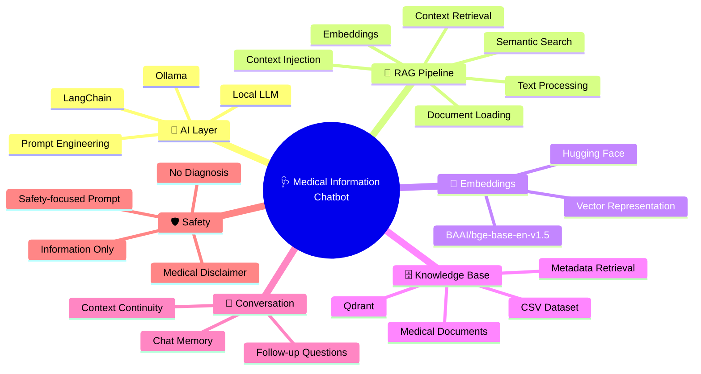
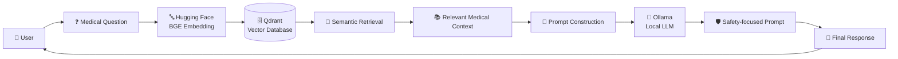
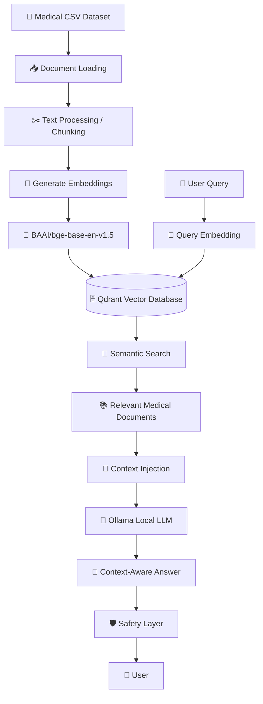
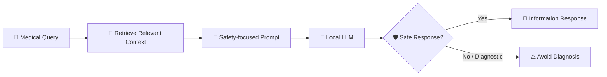
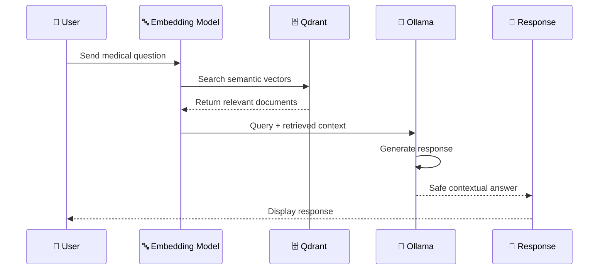

# 🩺 Medical Information Chatbot — LLM + RAG


<div align="center">


<br><br>


<br>

**An AI-powered medical information assistant built with RAG, semantic search, vector retrieval and local LLM inference.**

<br>

> ⚠️ **Important:** This project is designed for medical information retrieval and educational experimentation. It does **not provide medical diagnosis or replace professional medical advice.**

</div>

---

## 🧠 What is this?

**Medical Information Chatbot** is a Retrieval-Augmented Generation (**RAG**) based chatbot designed to answer medical information queries using knowledge retrieved from a medical document dataset.

Instead of relying only on the knowledge stored inside an LLM, the system first searches a vector database for relevant medical information and then provides that context to a **local LLM running through Ollama**.

This approach helps the chatbot generate responses that are more **context-aware and grounded in the available medical documents**.

### 💡 Core Idea

```text
User Question
      ↓
Semantic Search
      ↓
Relevant Medical Documents
      ↓
Context + User Query
      ↓
Local LLM
      ↓
Context-Aware Response

```

---

# 🗺️ System Mind Map



---

# 🏗️ System Architecture



---

# 🔄 RAG Pipeline

The chatbot follows a Retrieval-Augmented Generation workflow.



---

# ⚙️ How It Works

## 1️⃣ Document Ingestion

The medical dataset is loaded from:

```text
data/medical/medical.csv
```

The documents are processed and prepared for semantic retrieval.

---

## 2️⃣ Embedding Generation

Medical text is converted into numerical vector representations using:

```text
BAAI/bge-base-en-v1.5
```

These embeddings allow the system to compare the semantic meaning of a user's question with the stored medical information.

---

## 3️⃣ Vector Storage

The generated embeddings are stored inside:

```text
Qdrant
```

Qdrant acts as the vector database responsible for efficient semantic retrieval and metadata-based filtering.

---

## 4️⃣ Query Retrieval

When the user asks a question:

```text
User Query
    ↓
Query Embedding
    ↓
Qdrant Search
    ↓
Relevant Medical Context
```

The most relevant information is retrieved from the vector database.

---

## 5️⃣ Context Injection

The retrieved medical information is added to the LLM prompt.

```text
User Question
      +
Retrieved Medical Context
      ↓
Prompt
```

---

## 6️⃣ Local LLM Generation

The final prompt is processed using a **local LLM through Ollama**.

```text
Ollama
   ↓
LLM Inference
   ↓
Generated Response
```

Running the model locally helps keep the inference pipeline independent from external hosted LLM APIs.

---

## 7️⃣ Conversation Memory

The chatbot maintains conversation context so that follow-up questions can be understood in relation to previous messages.

Example:

```text
User:
What are common symptoms of diabetes?

Bot:
[Medical information response]

User:
Which of these symptoms are more common?

Bot:
[Context-aware follow-up response]
```

---

# ✨ Key Features

| Feature                          | Description                                                         |
| -------------------------------- | ------------------------------------------------------------------- |
| 🧠 **RAG-based QA**              | Retrieves relevant medical information before generating a response |
| 🔎 **Semantic Search**           | Finds information based on meaning rather than exact keywords       |
| 🤗 **Hugging Face Embeddings**   | Uses `BAAI/bge-base-en-v1.5` for text embeddings                    |
| 🗄️ **Qdrant Vector DB**         | Stores and retrieves document embeddings                            |
| 🦙 **Local LLM**                 | Runs LLM inference locally using Ollama                             |
| 💬 **Conversation Memory**       | Maintains context across conversations                              |
| 🛡️ **Safety-focused Prompting** | Designed to avoid medical diagnosis                                 |
| 📚 **Document-grounded Answers** | Uses retrieved medical context to support responses                 |

---

# 🛠️ Tech Stack

<div align="center">

| Category                | Technology                |
| ----------------------- | ------------------------- |
| 🐍 Programming Language | **Python**                |
| 🔗 AI Framework         | **LangChain**             |
| 🤗 Embeddings           | **Hugging Face**          |
| 🔤 Embedding Model      | **BAAI/bge-base-en-v1.5** |
| 🗄️ Vector Database     | **Qdrant**                |
| 🦙 Local LLM Runtime    | **Ollama**                |
| 📚 Knowledge Source     | **Medical CSV Dataset**   |
| 🔎 Retrieval            | **Semantic Search**       |
| 💬 Memory               | **Conversation Memory**   |

</div>

---

# 🧩 Technology Architecture

```text
                    🩺 MEDICAL AI CHATBOT
                            │
          ┌─────────────────┼─────────────────┐
          │                 │                 │
          ▼                 ▼                 ▼
     📚 KNOWLEDGE       🧠 RETRIEVAL       🤖 GENERATION
        LAYER              LAYER              LAYER
          │                 │                 │
          ▼                 ▼                 ▼
   Medical Dataset      BGE Embeddings      Ollama
          │                 │                 │
          ▼                 ▼                 ▼
     CSV Documents       Qdrant DB          Local LLM
          │                 │                 │
          └─────────────────┼─────────────────┘
                            │
                            ▼
                    💬 FINAL RESPONSE
```

---

# 📂 Project Structure

```text
Medical-Information-Chatbot/
│
├── 📁 data/
│   └── 📁 medical/
│       └── medical.csv
│
├── 📄 ingest.py
├── 📄 main.py
├── 📄 requirements.txt
├── 📄 README.md
│
└── 📁 ...
```

### Important Files

| File                       | Purpose                                                   |
| -------------------------- | --------------------------------------------------------- |
| `ingest.py`                | Processes the medical dataset and prepares vector storage |
| `main.py`                  | Runs the chatbot application                              |
| `requirements.txt`         | Contains required Python dependencies                     |
| `data/medical/medical.csv` | Medical knowledge dataset                                 |

---

# 🚀 Getting Started

## 1️⃣ Clone the Repository

```bash
git clone https://github.com/YOUR_USERNAME/YOUR_REPOSITORY.git
```

```bash
cd YOUR_REPOSITORY
```

---

## 2️⃣ Create a Virtual Environment

```bash
python -m venv venv
```

### Windows

```bash
venv\Scripts\activate
```

### macOS / Linux

```bash
source venv/bin/activate
```

---

## 3️⃣ Install Dependencies

```bash
pip install -r requirements.txt
```

---

# 🦙 Ollama Setup

This project uses **Ollama** for local LLM inference.

Install Ollama on your system and make sure the required model is available locally.

Example:

```bash
ollama pull <your-model-name>
```

Then verify Ollama:

```bash
ollama list
```

> Replace `<your-model-name>` with the local model configured in your project.

---

# 📚 Add the Medical Dataset

The dataset is **not included in the repository due to GitHub size limitations**.

Place your CSV file at:

```text
data/medical/medical.csv
```

Your final structure should look like:

```text
data/
└── medical/
    └── medical.csv
```

---

# ▶️ Run the Project

### Step 1 — Ingest the Dataset

```bash
python ingest.py
```

This prepares the medical documents and stores their vector representations for retrieval.

### Step 2 — Start the Chatbot

```bash
python main.py
```

The chatbot can now process medical information queries using the RAG pipeline.

---

# 💬 Example Interaction

### 👤 User

```text
What are common symptoms of high blood pressure?
```

### 🤖 Chatbot

```text
High blood pressure often does not cause noticeable symptoms.
When symptoms do occur, they may include headaches, dizziness,
or other nonspecific symptoms.

This information is provided for educational purposes and
should not be considered a medical diagnosis.
```

> The exact response depends on the retrieved documents and the local LLM being used.

---

# 🔍 Why RAG?

A normal LLM generates answers primarily from information encoded during training.

A RAG system adds an additional retrieval step.

### ❌ Traditional LLM

```text
User Question
      ↓
     LLM
      ↓
   Response
```

### ✅ RAG-based LLM

```text
User Question
      ↓
Semantic Search
      ↓
Medical Knowledge Base
      ↓
Relevant Context
      ↓
     LLM
      ↓
Grounded Response
```

### 🚀 Advantages of RAG

* 📚 Can use an external knowledge base
* 🔎 Retrieves relevant information dynamically
* 🧠 Provides additional context to the LLM
* 🔄 Knowledge can be updated by changing the document source
* 🗄️ Supports metadata-based retrieval
* 🦙 Can work with locally hosted LLMs

---

# 🛡️ Medical Safety

This project intentionally focuses on **medical information retrieval**, not medical diagnosis.

### The chatbot should NOT be treated as:

```text
❌ A doctor
❌ A diagnostic system
❌ A replacement for professional medical care
❌ An emergency medical service
```

### Intended use:

```text
✅ Educational information
✅ Medical document retrieval
✅ General health information
✅ RAG experimentation
✅ GenAI learning
```

### Safety Philosophy



---

# 🧠 Core Concepts Demonstrated

This project demonstrates practical implementation of:

```text
                ┌──────────────────────┐
                │   🤖 GENERATIVE AI   │
                └──────────┬───────────┘
                           │
          ┌────────────────┼────────────────┐
          │                │                │
          ▼                ▼                ▼
       🧠 RAG          🔤 EMBEDDINGS      🦙 LLM
          │                │                │
          ▼                ▼                ▼
    LangChain        Hugging Face       Ollama
          │                │
          └────────┬───────┘
                   ▼
             🗄️ Qdrant
                   │
                   ▼
            🔎 Semantic Search
                   │
                   ▼
            💬 Contextual AI
```

---

# 📊 RAG vs Traditional Chatbot

| Capability               | Traditional Chatbot | This Project |
| ------------------------ | :-----------------: | :----------: |
| External Knowledge Base  |          ❌          |       ✅      |
| Semantic Retrieval       |          ❌          |       ✅      |
| Vector Database          |          ❌          |       ✅      |
| Context Injection        |          ❌          |       ✅      |
| Local LLM                |       Optional      |       ✅      |
| Conversation Memory      |       Optional      |       ✅      |
| Medical Safety Prompting |       Optional      |       ✅      |

---

# 🔄 Complete Data Flow



---

# 📈 Project Highlights

<div align="center">

| 🚀 Component                   | ⭐ Implementation |
| ------------------------------ | ---------------- |
| Retrieval-Augmented Generation | ✅                |
| Semantic Vector Search         | ✅                |
| Hugging Face Embeddings        | ✅                |
| Qdrant Vector Database         | ✅                |
| Local LLM Inference            | ✅                |
| Ollama Integration             | ✅                |
| Conversation Memory            | ✅                |
| Safety-focused Prompting       | ✅                |

</div>

---

# 🔮 Future Improvements

Potential future improvements include:

* 🌐 Web-based chatbot interface
* 🎙️ Voice input and output
* 📄 Support for PDFs and medical research papers
* 🧠 Advanced reranking models
* 🔍 Hybrid keyword + semantic search
* 📊 RAG evaluation metrics
* 🧪 Retrieval quality evaluation
* 🛡️ More advanced safety guardrails
* 👨‍⚕️ Human-in-the-loop validation
* 📈 Response confidence and source references
* 🔐 Improved privacy and local data handling

---

# 🎯 Use Cases

### 📚 Education

Students can experiment with RAG architectures and medical knowledge retrieval.

### 🧠 GenAI Research

Useful for experimenting with:

```text
LLMs
+
Embeddings
+
Vector Databases
+
RAG
```

### 🔎 Information Retrieval

The system demonstrates how large document collections can be searched semantically.

### 🧪 RAG Experimentation

Useful as a practical project for understanding end-to-end Retrieval-Augmented Generation systems.

---

# ⚡ Quick Start

```bash
# Clone repository
git clone https://github.com/YOUR_USERNAME/YOUR_REPOSITORY.git

# Enter project
cd YOUR_REPOSITORY

# Install dependencies
pip install -r requirements.txt

# Add dataset
# data/medical/medical.csv

# Build vector database
python ingest.py

# Start chatbot
python main.py
```

---

# 🧰 Requirements

Before running the project, make sure you have:

```text
🐍 Python
📦 pip
🦙 Ollama
🗄️ Qdrant
🤗 Hugging Face model access
📄 Medical dataset
```

---

# ⚠️ Disclaimer

> **Medical Disclaimer:** This project is an experimental AI system intended for educational and informational purposes only. It is not a medical device and should not be used for diagnosis, treatment, medication decisions, or emergency medical situations. Always consult a qualified healthcare professional for medical advice.

---

# 🌟 Project Vision

```text
        📚 KNOWLEDGE
             │
             ▼
      🔎 RETRIEVAL
             │
             ▼
       🧠 CONTEXT
             │
             ▼
        🤖 GENERATION
             │
             ▼
        🛡️ SAFETY
             │
             ▼
       💬 INFORMATION
```

### Building AI that retrieves knowledge before generating answers.

---

# ⭐ If You Like This Project

If you found this project useful for learning **RAG, LLMs, embeddings, Qdrant, LangChain or GenAI**, consider giving the repository a ⭐.

---

<div align="center">


### 🧠 Retrieve. Reason. Respond. Responsibly.

<br>

**Built with ❤️ using Python + LangChain + Hugging Face + Qdrant + Ollama**

<br>


<br><br>

### ⭐ Star the repository if you found it interesting!

</div>


